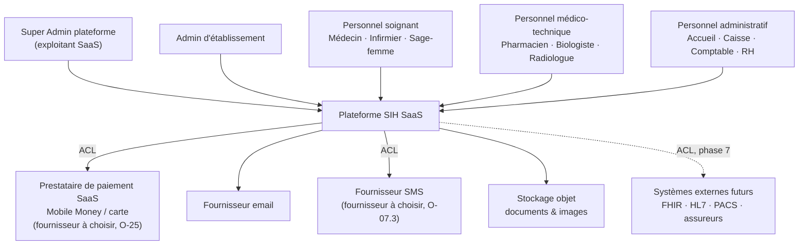
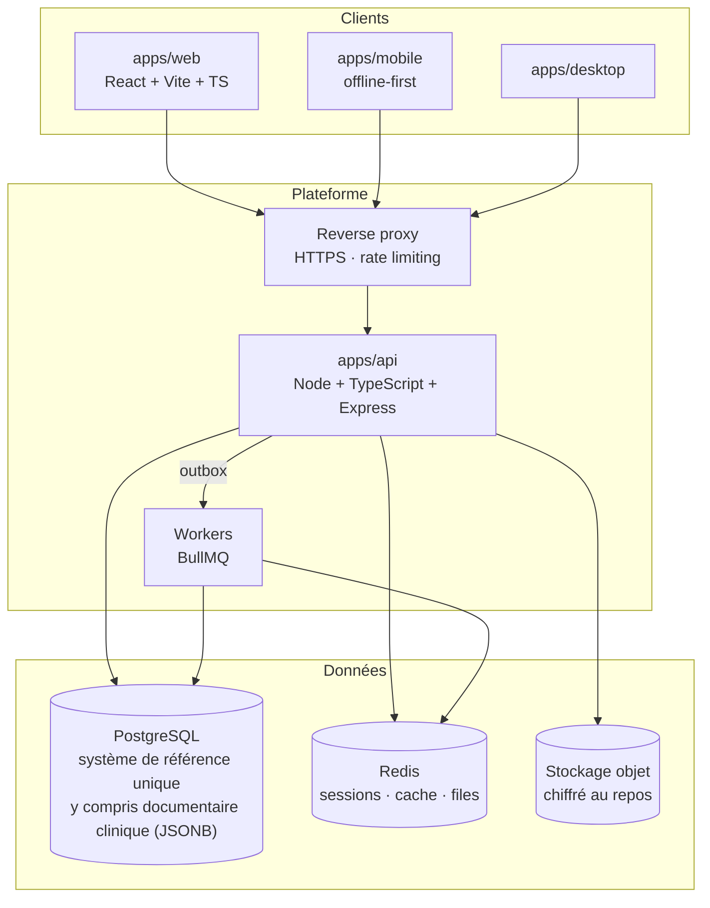
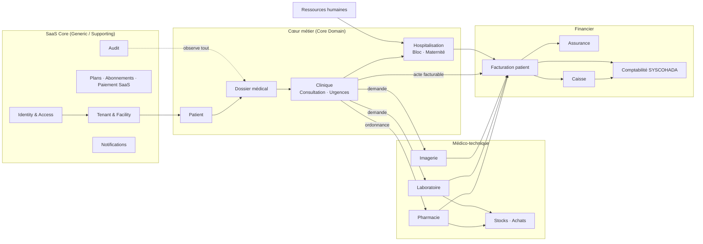

# 01 — Architecture cible

- **Statut** : Proposé
- **Date** : 2026-08-23
- **Portée** : plateforme SIH SaaS multi-établissements. Document de conception, sans code.

---

## 1. Vue de contexte (C4 niveau 1)



Chaque flèche vers un système externe traverse obligatoirement un **Anti-Corruption Layer**
(§10.4) : aucun format externe ne pénètre dans le domaine.

## 2. Vue conteneurs (C4 niveau 2)



**Décision — un seul déploiement API, modulaire.** Pas de microservices en V1 : le coût
opérationnel (observabilité distribuée, cohérence, DR) est disproportionné face à l'effectif
et à la priorité « fiabilité ». Les **frontières de module sont posées dès maintenant** dans
le code pour qu'une extraction ultérieure reste possible sans réécriture.

## 3. Multi-tenancy

### 3.1 Décision

**Schéma partagé + colonne `tenant_id` obligatoire + Row-Level Security PostgreSQL**,
avec possibilité de promouvoir un établissement vers un **schéma dédié** en cas d'exigence
réglementaire ou de volumétrie. Détail complet et alternatives : [ADR-0001](adr/0001-multi-tenancy-strategy.md).

### 3.2 Défense en profondeur — 5 couches

L'isolation ne repose **jamais** sur une seule barrière.

| Couche | Mécanisme | Ce qu'elle protège |
|---|---|---|
| 1. Session | Le `tenantId` est résolu **serveur** depuis le jeton, jamais lu du corps ni de l'URL | Usurpation de tenant par le client |
| 2. Application | `TenantId` est un Value Object **obligatoire** dans chaque Command, Query et signature de repository | Oubli de filtrage par un développeur |
| 3. Persistance | Chaque repository injecte le prédicat tenant ; aucune méthode ne l'accepte comme optionnel | Requête ad hoc mal écrite |
| 4. Base | `SET LOCAL app.tenant_id` par transaction + politique RLS sur chaque table tenant | Bug applicatif, injection SQL, requête manuelle |
| 5. Test | Suite « non-fuite inter-tenant » exécutée en CI sur chaque agrégat exposé | Régression |

La couche 4 est la garantie de dernier recours : **même un code applicatif fautif ne peut pas
lire les données d'un autre établissement.** C'est ce qui justifie de faire de PostgreSQL le
système de référence (ADR-0002).

### 3.3 Modèle de tenancy

- `tenant` = **un établissement de santé**. Un établissement multi-sites reste **un** tenant,
  la notion de site/bâtiment étant interne (§6.4). *À VALIDER MÉTIER : un groupe hospitalier
  souhaitant une vue consolidée inter-établissements n'est pas couvert en V1 (voir 03,
  point O-24).*
- Un utilisateur appartient à **la plateforme** (`SUPER_ADMIN`) ou à **0..N tenants** via un
  `UserTenantMembership` par établissement — **clos par O-05** (voir §6.3 et §7.1). Ce n'est
  plus un point ouvert.
- Les données de **niveau plateforme** (tenants, plans, abonnements, factures SaaS, audit
  global) vivent dans un schéma `platform` non soumis au RLS tenant, accessible uniquement
  par le rôle `SUPER_ADMIN`.

## 4. Monorepo

```
apps/
├── api/                 # Backend Node + TypeScript + Express
├── web/                 # React + Vite + Tailwind + TanStack Query + Zustand
├── mobile/              # Client offline-first (phase 7)
└── desktop/             # Enveloppe desktop (phase 7)
packages/
├── types/               # Types partagés API <-> clients, générés depuis OpenAPI
├── validation/          # Schémas de validation partagés
├── ui/                  # Design system
├── auth/                # Contrats d'authentification/permissions côté client
└── config/              # Configuration typée, conventions fr-SN / Africa/Dakar / XOF
docker/
infra/
scripts/
docs/
├── architecture/        # Ce dossier
├── adr/
├── modules/
├── security/
├── medical/
├── billing/
├── accounting/
├── api/
├── mobile/
├── desktop/
├── deployment/
├── production/
└── disaster-recovery/
```

**Règle** : `packages/types` et `packages/validation` sont dérivés des contrats OpenAPI, pas
l'inverse. Aucun type de domaine backend n'est exporté vers le frontend — le frontend consomme
des **DTO**, jamais des entités.

## 5. Organisation du code

Clean Architecture stricte, un dossier par Bounded Context sous `apps/api/src/modules/`.

```
modules/<contexte>/
├── domain/           # Entités, agrégats, VO, événements, erreurs, ports repository
├── application/      # Commands, Queries, Handlers, ports sortants
├── infrastructure/   # Persistance, messagerie, adaptateurs externes
└── presentation/     # Contrôleurs HTTP, DTO, OpenAPI
```

**Règles vérifiées automatiquement en CI** (dependency-cruiser) :

- `domain/` n'importe **aucun** framework, aucune bibliothèque d'accès aux données, aucun
  `process.env`, aucun `Date.now()` ni `Math.random()` direct — le temps et l'aléatoire sont
  injectés via les ports `Clock` et `IdGenerator`.
- `application/` n'importe jamais `infrastructure/`.
- Un module n'importe jamais le `domain/` d'un autre module ; les échanges passent par
  **événements** ou par **ports explicites**.
- Un `composition-root.ts` unique câble les dépendances. Aucun singleton global.

**Gestion d'erreurs** : `Result<T>` pour les erreurs métier attendues (facture déjà émise,
lit indisponible, quota de forfait atteint) ; exceptions réservées aux défaillances techniques.

## 6. Modèle de données de haut niveau

### 6.1 Langage ubiquitaire (extrait — à compléter par contexte)

| Français (métier) | Anglais (code) | Contexte |
|---|---|---|
| Établissement de santé | `HealthFacility` | Tenant |
| Abonnement | `Subscription` | SaaS Core |
| Forfait | `Plan` | SaaS Core |
| Patient | `Patient` | Patient |
| Numéro patient | `PatientNumber` | Patient |
| Dossier médical électronique | `MedicalRecord` | DME |
| Consultation | `Encounter` | Clinique |
| Constantes / paramètres vitaux | `VitalSigns` | Clinique |
| Prescription | `Prescription` | Clinique |
| Séjour hospitalier | `InpatientStay` | Hospitalisation |
| Admission | `Admission` | Hospitalisation |
| Lit | `Bed` | Hospitalisation |
| Demande d'examen | `LabOrder` / `ImagingOrder` | Labo / Imagerie |
| Dispensation | `Dispensation` | Pharmacie |
| Facture patient | `PatientInvoice` | Facturation |
| Écriture comptable | `JournalEntry` | Comptabilité |
| Prise en charge (assurance) | `InsuranceCoverage` | Assurance |
| Ticket modérateur | `PatientCoPayment` | Assurance |

Le glossaire complet est un livrable **par Bounded Context**, dans `docs/domain/glossary.md`.

### 6.2 Carte des contextes



Relations typées :
- `Identity & Access` → tous : **Shared Kernel** restreint (`TenantId`, `UserId`, `Permission`).
- `Clinique` → `Facturation` : **Customer/Supplier** via l'événement `ActeRealise`
  (`ClinicalActPerformed`). La facturation ne lit jamais le dossier médical.
- `Facturation` → `Comptabilité` : **Published Language** — un contrat d'événement stable.
- Tout système externe : **Anti-Corruption Layer**.

### 6.3 SaaS Core

**Agrégats** : `Tenant`, `UserAccount`, `UserTenantMembership`, `Role`, `Plan`, `Subscription`,
`PlatformInvoice`, `Payment`, `AuditEntry`, `Notification`.

**Identité multi-établissements (O-05, clos le 2026-08-23)** :
- `UserAccount` porte l'identité globale de la personne — **aucun `tenantId` dessus**.
- `UserTenantMembership` porte l'appartenance à **un** établissement : `userId`, `tenantId`,
  `status` (actif/suspendu/révoqué), dates d'entrée/sortie, métadonnées d'audit. Un `UserAccount`
  a `0..N` memberships.
- **Le rôle est porté par le membership, pas par l'identité** : un même utilisateur peut être
  `MEDECIN` dans l'établissement A et `ADMIN_ETABLISSEMENT` dans l'établissement B.
- **Plusieurs rôles simultanés par membership sont autorisés** (`Membership → Roles[]`) — les
  permissions effectives sont l'**union additive** des permissions de ces rôles (le catalogue
  RBAC de §7.2 est purement additif, sans notion de *deny*, ce qui rend cette union non
  ambiguë). Évite les rôles composites artificiels (`MEDECIN_COMPTABLE`, etc.).
- **Conséquences dérivées, non optionnelles** :
  - Le quota `maxUsers` (O-02.3) compte des **memberships actifs**, jamais des rôles.
  - Le **plancher MFA (O-04.1/O-04.2)** s'applique au membership dès qu'**un seul** de ses
    rôles l'exige — le plus restrictif l'emporte. Un cumul de rôles ne peut jamais servir à
    contourner l'obligation attachée à l'un d'eux.
- **Révocation d'un membership** : interdit immédiatement l'ouverture d'un nouveau contexte
  pour ce tenant et **invalide les contextes de session déjà ouverts** pour ce membership.
- Résolution complète : `User authentifié → membership actif → tenant sélectionné → rôles →
  permissions → contexte de session`. Le client ne fournit jamais `tenantId`, `role` ni
  `permissions` comme preuve — seuls sont acceptés une sélection d'intention, vérifiée
  systématiquement côté serveur contre les memberships réels.

Invariants notables :
- Un `Tenant` a exactement un `Subscription` actif à un instant donné.
- Le `Plan` porte un **jeu de capacités et de limites en données** (`features[]`, `limits{}`),
  administré par le Super Admin. Le frontend n'a **aucun** forfait codé en dur : il consulte
  les capacités effectives du tenant via un endpoint dédié.
- **Politique d'impayé (O-03, clos sous réserve juridique le 2026-08-23)** : à l'échéance
  impayée, l'abonnement entre dans une **période de grâce de 7 jours** (3 rappels via SMS +
  email en parallèle, §9.4 — **calendrier exact des 3 rappels dans la fenêtre encore en
  résidu**). Sans régularisation, il passe en **mode dégradé pendant 30 jours** : continuité
  des soins garantie (accès aux dossiers, écriture clinique nécessaire
  à la prise en charge maintenue, audit renforcé), fonctions commerciales/administratives non
  essentielles restreintes. Au-delà de J+37, le mode dégradé est **maintenu indéfiniment sans
  restriction clinique supplémentaire ni suspension complète** — le recouvrement au-delà relève
  du commercial/contractuel, jamais d'une dégradation technique du soin. **Aucune suppression
  de données à aucune étape.** Le mécanisme de bris de glace éventuel reste hors périmètre de
  cette politique et appartient exclusivement à O-08 (Phase 3). *Reliquat : validation
  juridique formelle avant mise en production, durée de conservation post-résiliation (O-15),
  modalités d'export, cadre réglementaire santé applicable au Sénégal.*
- Les **quotas de forfait** sont vérifiés dans un **Domain Service** appelé par les handlers de
  commande concernés, jamais dans le contrôleur.

**Modèle de tarification (O-02, clos le 2026-08-23)**

- **`Plan` ≠ `PlanPrice`** : le prix (montant, devise XOF, période, `effectiveFrom`) est
  historisé séparément des capacités. Modifier un tarif n'affecte jamais rétroactivement un
  abonnement en cours. Aucun prix codé en dur côté frontend.
- **Catalogue V1** : STANDARD 35 000 FCFA/mois · 350 000 FCFA/an — PROFESSIONNEL
  55 000 FCFA/mois · 550 000 FCFA/an — COMPLET 75 000 FCFA/mois · 750 000 FCFA/an (remise
  annuelle ~16,7 %, soit 2 mois offerts).
- **Unité de facturation : par établissement** (Option D, hybride) — un `Subscription` par
  `Tenant`, capacités et limites (`maxUsers`, `maxBeds` — seules limites V1) rattachées au
  `Plan`. Valeurs exactes et règle de dépassement : voir
  [03-open-decisions.md, O-02](03-open-decisions.md#o-02--modèle-de-tarification-des-forfaits).
- **Dépassement de limite : comportement différencié par type de ressource**, piloté par la
  donnée du `Plan` (pas un comportement uniforme codé en dur). Règle absolue : aucune donnée
  clinique existante n'est supprimée ni rendue inaccessible pour cause de dépassement ; aucun
  acte nécessaire à la prise en charge d'un patient n'est bloqué par une limite sans règle
  métier explicite l'autorisant.
- **Essai gratuit** : un `Subscription` sur le forfait STANDARD avec `trialEndsAt` renseigné,
  sans moyen de paiement requis à l'activation, 30 jours. Pas d'état "démo" séparé — réutilise
  le modèle `Plan`/`Subscription` existant. Les données créées pendant l'essai (y compris
  `Patient`) reçoivent les **mêmes garanties RLS/audit/chiffrement** qu'un compte payant ; leur
  devenir en cas de non-conversion est traité avec O-03, pas dupliqué ici.
- **Changement de forfait** : upgrade immédiat et proratisé (nouvelles capacités disponibles
  aussitôt) ; downgrade différé à la fin de la période en cours (le forfait actuel reste actif
  jusqu'au renouvellement — cohérent avec la règle de non-régression clinique ci-dessus).
  Méthode exacte de proratisation (calcul au jour près, arrondi, upgrades multiples) : voir
  [03-open-decisions.md, O-02](03-open-decisions.md#o-02--modèle-de-tarification-des-forfaits).
- **Remises** : administrées par le Super Admin via un agrégat `DiscountCoupon` (montant ou
  pourcentage, période de validité, forfait concerné, nombre d'utilisations) — traçable, sans
  modification directe du prix catalogue ni du prix d'une souscription individuelle.
- **TVA** : champ **configurable**, non appliqué par défaut. Aucun régime fiscal n'est présumé
  applicable aux prestations de santé au Sénégal — décision liée à O-13 (mapping SYSCOHADA),
  arbitrage attendu d'un expert-comptable OHADA avant Phase 6.

**Provisioning d'établissement (§3 du cahier des charges)** — c'est une **Saga**, pas une
transaction unique, car elle traverse plusieurs agrégats et un système de paiement externe :

```
CreateUserAccount → CreateTenant → CreateSubscription (pending)
   → InitiatePayment (externe, ACL) → [succès] ActivateSubscription
   → GrantRole ADMIN_ETABLISSEMENT → SeedFacilityConfiguration → StartOnboarding
```

Chaque étape publie un événement ; chaque étape possède une **compensation explicite**
(annulation de tenant, révocation de rôle, abandon d'abonnement). Les états
`échoué / en attente / annulé / expiré / renouvelé` sont des états **explicites de la Saga**,
pas des cas d'erreur implicites. Aucune transaction distribuée à deux phases.

**Paiement SaaS (O-25, clos structurellement le 2026-08-23)** — distinct d'O-18 (paiement
patient → établissement, §6.8) : deux flux, deux agrégats déjà séparés (`Payment` ici vs
`PatientInvoice`/`CashRegisterSession` en §6.8), aucun credential ni compte de règlement
partagé.

- **Périmètre V1** : abonnement initial + renouvellements + upgrade proratisé (O-02.6).
  Remboursement d'abonnement SaaS **explicitement hors V1** (distinct d'O-22, remboursement de
  facture patient) — à réintroduire par une décision dédiée si nécessaire.
- **Moyens de paiement** : Mobile Money + carte bancaire. Virement possible en règlement
  manuel/commercial, **exclu du flux automatisé `InitiatePayment`**.
- **Frais de transaction absorbés par la plateforme** — l'établissement paie exactement le
  `PlanPrice` catalogue (O-02.1), jamais de supplément selon le moyen de paiement. Si cette
  règle change un jour, le supplément devra être une ligne distincte à l'encaissement, jamais
  une modification du `PlanPrice` lui-même (préserverait O-02).
- **Confirmation exclusivement serveur-à-serveur** : jamais d'activation sur retour frontend.
  États réutilisés tels quels (`PENDING/SUCCEEDED/FAILED/EXPIRED/ANNULÉ/RENOUVELÉ`), aucune
  machine à états spécifique à O-25. Idempotence par identifiant de transaction fournisseur
  (même principe que l'Outbox, D9). Signature de webhook obligatoire, rejet silencieux sinon.
  Rapprochement périodique avec l'API du prestataire — le webhook n'est jamais l'unique source
  de vérité.
- **Jonction avec O-03, catalogue d'événements** :

  ```
  SubscriptionRenewalDue (scheduler, pas un webhook)
     → aucun SUCCEEDED confirmé → SubscriptionGracePeriodStarted
     → J+7 sans régularisation → SubscriptionDegradedModeEntered
     → J+37 sans régularisation → SubscriptionDegradedModeSustained (maintien indéfini)
  ```

  Le déclenchement de la grâce est piloté par **l'échéance**, pas seulement par un webhook
  `FAILED` — une panne de webhook ne doit jamais laisser un établissement impayé indéfiniment
  en accès complet. Un `SaaSPaymentSucceeded` reçu à **tout moment** pendant la grâce ou le
  mode dégradé déclenche `SubscriptionReactivated` **immédiatement**, sans attendre le
  prochain contrôle programmé.
- **Architecture d'intégration** : résolue par les principes déjà acceptés — port
  `PaymentProvider`, implémentation dans `infrastructure/`, Anti-Corruption Layer (D10).
  **Aucun fournisseur codé en dur dans le domaine ou la Saga.**
- **Résidus opérationnels, dépendants du prestataire retenu (non bloquants pour
  l'architecture)** : fournisseur de paiement SaaS ; compte de règlement légal ; fréquence des
  reversements.

### 6.4 Tenant & Établissement

`HealthFacility` (agrégat racine du tenant) → `FacilityType` (9 types, §7) →
`Service` (activable à la carte, §8) → `Building` → `Room` → `Bed`.

Le **catalogue des services** (médicaux, médico-techniques, administratifs) est une **donnée de
référence versionnée**, pas une énumération codée en dur : chaque établissement active un
sous-ensemble. L'activation d'un service est soumise aux capacités du forfait.

`Bed` porte un statut : `Disponible | Occupé | Réservé | Nettoyage | Maintenance | HorsService`
(§27). Les transitions sont un invariant de l'agrégat `Room`/`Bed`, pas un champ librement
modifiable. *À VALIDER MÉTIER : qui est habilité à passer un lit en « Hors service », et
qu'advient-il d'un séjour en cours sur ce lit.*

### 6.5 Patient et DME

- `Patient` (agrégat) : identité, `PatientNumber` **unique par établissement** (§9), sexe,
  date de naissance, adresse, téléphone `+221`, contact d'urgence, couverture assurance.
- `MedicalRecord` (agrégat) : point d'entrée du dossier. Il **référence** par identifiant les
  consultations, séjours, prescriptions, résultats, images — il ne les contient pas. Un dossier
  patient croît indéfiniment ; en faire un seul agrégat chargé en mémoire est un anti-pattern.
- `Allergy`, `MedicalHistory`, `CurrentTreatment` sont portés par le dossier car ce sont des
  informations de **sécurité du soin** consultées en permanence.

**Règle d'accès (§10, §31)** : `tenant` **et** `rôle` **et** `permission` **et**
`contexte clinique`. Les trois premiers sont mécaniques. Le **contexte clinique** — quel lien
de soin autorise ce professionnel à ouvrir ce dossier — est **À VALIDER MÉTIER** (voir 03,
point O-08). Tant qu'il n'est pas défini, l'architecture prévoit le point d'extension
(`ClinicalAccessPolicy` en Strategy) mais **aucune règle par défaut ne sera inventée**.

Corollaire imposé par le cahier des charges : *« jamais d'accès à un dossier par simple
connaissance de l'ID »*. Concrètement, aucun identifiant séquentiel exposé, contrôle
d'autorisation **par ressource** systématique, et **chaque ouverture de dossier est auditée**,
qu'elle soit autorisée ou refusée.

### 6.6 Clinique, hospitalisation, bloc, maternité

- `Encounter` (consultation) : motif, histoire, constantes, examen clinique, hypothèses,
  diagnostic, actes, prescriptions, examens demandés, conclusion (§12).
  **Invariant** : une consultation validée devient immuable. Une correction crée une
  **version rectificative** liée à l'originale, auditée, jamais un écrasement.
  *À VALIDER MÉTIER : qui peut rectifier, dans quel délai, et si un motif est obligatoire.*
- `EmergencyEncounter` (§13) : ajoute triage et niveau de priorité. **L'échelle de triage
  n'est pas définie par le cahier des charges — À VALIDER MÉTIER** (voir 03, point O-09).
- `InpatientStay` (§14) : admission → unité → chambre → lit → séjour → sortie. Les événements
  `Transfert`, `ChangementDeLit`, `Sortie`, `SortieContreAvisMédical`, `Décès` sont des
  **transitions d'état explicites** de l'agrégat, chacune auditée.
- `SurgicalProcedure` (§15) : programmation, salle, équipe, matériel, implants, consommables,
  anesthésie, compte rendu opératoire, surveillance post-opératoire. La consommation de
  matériel émet un événement vers `Stocks`.
- `Pregnancy` / `Delivery` / `Newborn` (§16) : le lien **mère ↔ nouveau-né** est modélisé
  explicitement. Le nouveau-né devient un `Patient` à part entière avec son propre dossier.
  *À VALIDER MÉTIER : à quel moment exact le nouveau-né obtient un `PatientNumber`, et le
  traitement des cas d'accouchement multiple ou de mortinaissance.*

### 6.7 Médico-technique

- **Pharmacie (§17)** : `Medication` (catalogue), `StockLot` (lot + péremption + emplacement),
  `Dispensation`. Invariants : pas de dispensation sans stock disponible ; **pas de
  dispensation depuis un lot périmé** ; traçabilité lot ↔ patient conservée.
- **Laboratoire (§18)** : `LabOrder` → `Specimen` (prélèvement) → `Analysis` → validation
  biologiste → `LabResult`. **Invariant fort : un résultat n'est visible dans le dossier
  patient qu'après validation par le biologiste.** L'état `validé` est irréversible ; une
  correction produit un résultat rectificatif lié.
- **Imagerie (§19)** : `ImagingOrder` → `ImagingStudy` (métadonnées + compte rendu) →
  validation → archivage. **Les pixels ne sont pas gérés en V1** : le modèle réserve les
  champs d'identification DICOM (`studyInstanceUid`, `accessionNumber`) pour un rattachement
  futur à un PACS, sans qu'aucune intégration ne soit annoncée.
- **Stocks (§25)** : agrégat `StockItem` multi-catégories (médicaments, dispositifs, réactifs,
  consommables, matériel, entretien) avec lot, expiration, emplacement, transferts, inventaire,
  pertes, casse. **Un seul modèle de stock pour tout l'établissement** ; la pharmacie en est un
  emplacement, pas un système parallèle.
- **Achats (§24)** : fournisseurs, demande d'achat, commande, réception, facture fournisseur,
  paiement. La réception alimente `Stocks` par événement.

### 6.8 Financier

- **Facturation (§20)** : `PatientInvoice` **agrège** les actes facturables produits par les
  autres contextes (consultation, actes, labo, imagerie, pharmacie, hospitalisation, bloc).
  Mécanisme : chaque contexte publie un événement `ActeRealise` porteur d'un code d'acte, d'une
  quantité et d'un identifiant de patient/séjour ; la facturation les accumule dans un
  `BillableItemLedger` puis produit la facture. **La facturation ne lit jamais le contenu
  clinique** — séparation exigée par la confidentialité médicale.
- **Assurance (§21)** : `Insurer`, `Convention`, `InsuranceCoverage`. Le **calcul de la part
  assureur, du ticket modérateur, des plafonds et des actes couverts est une `CoveragePolicy`
  injectée, versionnée et datée** — jamais une constante dans le code. **Aucune règle de
  taux, plafond ou tiers payant n'est définie ici : À VALIDER MÉTIER** (voir 03, point O-12).
- **Caisse (§22)** : `CashRegisterSession` (ouverture → encaissements → clôture →
  rapprochement). Moyens : espèces, carte, mobile money, virement. Invariant : une session
  clôturée est immuable ; tout écart de caisse est un champ explicite et audité.
- **Comptabilité (§23)** : `Account` (plan **SYSCOHADA révisé**), `Journal`, `FiscalYear`,
  `JournalEntry`. **Invariant d'agrégat : somme des débits === somme des crédits**, une écriture
  déséquilibrée ne peut pas exister. Une écriture validée n'est jamais modifiée — seule une
  écriture d'extourne la corrige. Le mapping recette hospitalière → compte SYSCOHADA est
  **À VALIDER MÉTIER** (voir 03, point O-13).
- **Montants** : `Money` en Value Object, `XOF` **entier sans décimale**, formaté via un
  utilitaire unique. Aucun flottant en persistance.

### 6.9 Ressources humaines (§26)

`StaffMember`, `Contract`, `WorkSchedule`, `Leave`, `Absence`, `OnCallDuty` (garde),
`StandbyDuty` (astreinte). Lien vers `UserAccount` **par identifiant uniquement** : un membre
du personnel n'est pas nécessairement un utilisateur, et réciproquement. La **paie est hors
scope V1**.

## 7. Sécurité

### 7.1 Authentification et contexte

- **Connexion (§4)** : l'utilisateur saisit uniquement email + mot de passe. Le serveur résout
  **seul** le contexte (`PLATFORM` → `SUPER_ADMIN`, ou `ETABLISSEMENT` → rôle métier) et le
  tenant. **Le client ne transmet jamais de tenant ni de rôle** ; toute tentative est
  ignorée et auditée.
- **Multi-établissement (O-05)** : si l'identité authentifiée porte plusieurs
  `UserTenantMembership` actifs (§6.3), le client soumet une **sélection d'intention**
  d'établissement, jamais un `tenantId` de confiance — le serveur la valide contre les
  memberships réels avant d'établir un contexte. **Changer d'établissement ferme le contexte de
  session courant et en émet un nouveau** ; ce n'est jamais une mutation en place du `tenantId`
  dans la session existante, afin qu'aucune requête ou job asynchrone déjà émis sous l'ancien
  contexte ne puisse s'exécuter sous le nouveau. Si le rôle du membership cible exige le MFA
  (O-04.1) alors que le contexte précédent ne l'exigeait pas, la réauthentification MFA est
  requise avant l'ouverture du nouveau contexte.
- **Sessions (O-06, clos structurellement le 2026-08-23, valeurs numériques en résidu)** :
  - **Plafond absolu** distinct de l'inactivité : une session ne peut jamais dépasser une durée
    maximale, quelle que soit l'activité. **Différencié par catégorie de sensibilité**, alignée
    sur les mêmes catégories qu'O-04.1 (pas une troisième taxonomie de risque) — un rôle soumis
    au MFA a le plafond le plus court. *Valeurs numériques par catégorie : À VALIDER.*
  - **Expiration d'inactivité** différenciée par les mêmes catégories : poste partagé/accueil
    (court), utilisateur individuel standard (intermédiaire), rôle à risque élevé (aligné O-04.1).
    Une valeur globale unique est techniquement rejetée — elle ne peut pas satisfaire à la fois
    la confidentialité sur poste partagé et la continuité d'un médecin en consultation.
    *Valeurs numériques par catégorie : À VALIDER.*
  - **Step-up (réauthentification renforcée)** : obligatoire pour les opérations sensibles
    (administration du tenant, opérations financières à fort impact — socle hérité d'O-04.1),
    indépendamment de la fraîcheur apparente de la session. Liste étendue au-delà de ce socle
    différée jusqu'à précision d'O-08/O-11 et des règles financières.
  - **Poste partagé** : expiration automatique courte (catégorie dédiée ci-dessus) **+**
    verrouillage manuel explicite (« Verrouiller / Changer d'utilisateur ») préservant le
    contexte de travail non validé lorsque c'est sûr. Toute action nécessitant une
    authentification reste bloquée tant que l'utilisateur suivant n'a pas authentifié son
    propre contexte.
  - **Renouvellement** : fenêtre glissante (l'activité prolonge l'inactivité jusqu'au plafond
    absolu) via **refresh token à rotation** — chaque utilisation invalide le précédent, une
    réutilisation détectée révoque toute la chaîne (pratique OWASP standard). Compatible avec
    O-05 : un changement d'établissement ferme le contexte et sa chaîne de rotation, en ouvre un
    nouveau.
  - **Résidu explicite, à fermer avant la fin de Phase 0** : valeurs numériques exactes des
    plafonds absolus et des paliers d'inactivité par catégorie.
- **MFA (O-04, clos le 2026-08-23, résidus explicites ci-dessous)** :
  - Déclenché par **catégorie de permission**, jamais par nom de rôle en dur — condition
    nécessaire pour rester valide face aux rôles personnalisés par établissement (§7.2).
  - **Plancher plateforme non désactivable** (O-04.2, modèle hybride) : `SUPER_ADMIN` (rayon
    inter-tenant, obligation quasi structurelle) ; tout rôle portant des permissions
    d'administration du tenant (gestion comptes/rôles) ; tout rôle portant des permissions
    financières à fort impact ou irréversible (paiement sensible, remboursement, clôture de
    caisse, écriture comptable sensible). Un établissement peut **renforcer** ce socle (l'étendre
    à d'autres rôles) mais jamais l'abaisser.
  - **Pas de MFA obligatoire généralisé aux rôles cliniques en V1** — catégorie explicitement
    réservée, dépendante d'O-08 et O-11, non tranchée pour éviter un couplage prématuré.
  - **Facteur primaire : TOTP** (hors ligne, aucun coût télécom). **WebAuthn/Passkey** accepté
    en alternative plus forte. **SMS exclu comme facteur primaire** — réservé, si retenu, à un
    usage de récupération de compte uniquement (O-04.4).
  - **Récupération** : codes de récupération à usage unique générés à l'enrôlement, plus
    procédure administrée avec vérification d'identité si les codes sont épuisés. **Un
    administrateur ne peut jamais désactiver silencieusement le MFA d'un compte** — seule une
    opération de **ré-enrôlement entièrement auditée** est possible.
  - **Audit MFA** : tout événement (enrôlement, activation, succès, échec, tentative de
    contournement, ré-enrôlement, récupération, remplacement de facteur) est journalisé dans
    l'agrégat `AuditEntry` (§6.3) — **distinct du journal d'audit médical de §7.3**, qui reste
    scopé à l'accès au dossier patient. Journal append-only : `tenantId` (si applicable),
    identifiant utilisateur, rôle au moment de l'événement, type d'événement, résultat,
    horodatage serveur, acteur déclencheur, motif si requis, corrélation session/device si
    disponible. **Jamais de secret TOTP, code OTP ou donnée d'authentification en clair.**
    Immuable, y compris pour `SUPER_ADMIN`. Rétention rattachée à O-15, non fixée ici.
  - **Résidus non fermés, à traiter avant la fin de Phase 0** : procédure de récupération
    opérationnelle pour `ADMIN_ETABLISSEMENT` (support plateforme, vérification d'identité —
    processus autant qu'implémentation) ; procédure de type *break-glass* pour `SUPER_ADMIN`
    (aucune autorité supérieure ne peut l'administrer par le modèle C standard).
- Mots de passe : hachage à coût mémoire élevé. Secrets exclusivement en variables
  d'environnement / gestionnaire de secrets, jamais dans le dépôt.

### 7.2 RBAC (§30)

Modèle : **Rôle → Permissions**, permission exprimée en `<ressource>:<action>`
(`patient:read`, `prescription:sign`, `invoice:cancel`).

- Rôles **système** fournis : les 18 rôles du §30.
- Rôles **personnalisés par établissement** : composables à partir du catalogue de permissions,
  **sans jamais pouvoir excéder les permissions du forfait** ni s'attribuer des permissions de
  niveau plateforme.
- Le **catalogue de permissions est de niveau plateforme** ; les rôles sont de niveau tenant.
- Contrôle d'accès **en deux temps** : permission (grossier, au niveau du handler) puis
  autorisation **par ressource** (fin, incluant tenant et contexte clinique).
- Anti-pattern refusé : vérification de permission dans le contrôleur HTTP seulement. Le
  contrôle doit être **inévitable** — appliqué dans l'application, pas dans le transport.

### 7.3 Audit médical (§32)

Journal **append-only**, physiquement distinct des logs applicatifs :
`qui · quoi · quand · depuis quelle session · quelle donnée · quelle modification ·
ancienne valeur → nouvelle valeur · résultat (autorisé/refusé)`.

- **Toute lecture d'un dossier patient est un événement d'audit**, pas seulement les écritures.
- Immuabilité : aucune permission de mise à jour ni de suppression n'est accordée sur ce
  journal, y compris au `SUPER_ADMIN`. Chaînage par empreinte pour détecter une altération.
- Rétention et purge : **À VALIDER** (voir 03, point O-15) — dépend du cadre réglementaire
  applicable au Sénégal, que ce document ne présume pas.
- Les logs applicatifs portent `correlationId`, `tenantId`, `actorId` et **jamais** de donnée
  personnelle de santé ni de secret.

### 7.4 Protection des données

- **En transit** : HTTPS obligatoire, HSTS, terminaison au reverse proxy.
- **Au repos** : chiffrement au niveau volume pour la base ; chiffrement côté serveur pour le
  stockage objet (documents, comptes rendus, images).
- **Sauvegardes chiffrées**, restauration testée périodiquement (§39) — une sauvegarde jamais
  restaurée n'est pas une sauvegarde.
- Environnements non-production : **jamais** de données de production réelles ; jeu de données
  synthétique obligatoire.

## 8. Stack technique

| Couche | Choix recommandé | Justification |
|---|---|---|
| Backend | **Node.js + TypeScript strict + Express** | Compétence de l'équipe, un seul langage sur toute la chaîne. `strict: true`, aucun `any`, aucun `@ts-ignore` |
| Base de référence | **PostgreSQL** | Transactions ACID, intégrité référentielle, **Row-Level Security** — c'est le RLS qui porte la 5ᵉ couche d'isolation tenant, et il n'a pas d'équivalent ailleurs |
| Documentaire clinique | **PostgreSQL / JSONB** (O-01 clos, Option B) | Isolation tenant homogène par RLS sur 100 % des données, y compris cliniques ; un seul moteur à exploiter. MongoDB écarté en V1 — voir [ADR-0002](adr/0002-database-stack.md) |
| Cache / sessions / files | **Redis** | Sessions révocables, verrous, backend BullMQ |
| Tâches asynchrones | **BullMQ** | Relais outbox, projections, notifications, rappels de rendez-vous |
| Frontend web | **React + TypeScript + Vite + Tailwind + TanStack Query + Zustand** | TanStack Query pour l'état serveur, Zustand pour l'état client — la distinction évite le magasin global fourre-tout |
| Stockage objet | Compatible S3 | Documents, comptes rendus, futures images |
| Exécution | **Docker**, reverse proxy, HTTPS, health checks, rate limiting | §39 |

**Points où un autre choix serait défendable — laissés ouverts :**

1. ~~PostgreSQL seul avec JSONB au lieu de PostgreSQL + MongoDB~~ — **tranché (O-01, clos
   2026-08-23) : PostgreSQL seul (Option B)**, voir [ADR-0002](adr/0002-database-stack.md).
2. **Fastify plutôt qu'Express** : meilleure validation de schéma et performance. Impact faible
   car l'architecture confine le framework à `presentation/`. **À VALIDER TECHNIQUE.**
3. **Modulith plutôt que microservices** : tranché en faveur du modulith (§2), à réévaluer
   au-delà d'un seuil de charge ou d'équipe.

## 9. Patterns transverses

### 9.1 CQRS

Commands (mutation, retour `void` ou identifiant, jamais de donnée métier) et Queries
(lecture, DTO/read model, aucun effet de bord) séparées.

Les **tableaux de bord par rôle (§29)** sont des **read models projetés**, jamais des
agrégations à la volée sur les tables transactionnelles. Le taux d'occupation des lits, les
recettes du jour ou les alertes de stock se lisent en une requête sur une projection.

### 9.2 Cohérence

**Une transaction = un agrégat.** Les processus traversant plusieurs agrégats sont des Sagas
avec compensations explicites : provisioning d'établissement, admission → affectation de lit,
prescription → dispensation → décrément de stock, facturation → paiement → écriture comptable.

Cohérence à terme **assumée et documentée** : chaque read model indique son retard acceptable.
Exception explicite : **la disponibilité d'un lit et le stock disponible sont lus en cohérence
forte** au moment de la décision, jamais depuis une projection — le risque métier d'un
double-booking de lit ou d'une dispensation d'un stock inexistant est inacceptable.

### 9.3 Événementiel

**Outbox Pattern obligatoire** : l'événement est persisté dans la même transaction que
l'agrégat, puis relayé par un worker BullMQ. Garantie *at-least-once* → **tout consommateur est
idempotent** (clé d'idempotence + registre des événements traités). Chaque événement est
versionné et documenté dans un catalogue (`docs/domain/events.md`). Les projections disposent
d'une procédure de **rebuild** documentée et testée.

### 9.4 Notifications (§28, O-07 clos le 2026-08-23)

Un contexte `Notifications` unique, alimenté par événements, envoi relayé par le worker
BullMQ de l'Outbox (§9.3) — **une défaillance d'envoi ne bloque jamais une opération métier ou
clinique**. **Un canal n'est exposé que s'il est réellement intégré et testé.**

- **Canaux V1 : Email + SMS**, chacun avec un rôle distinct :
  - **Email** : canal général — administratif, facturation, comptes, invitations, rapports,
    notifications non urgentes.
  - **SMS** : canal court à forte probabilité de lecture — rappels de rendez-vous, rappels
    d'impayé (O-03.2).
- **Hors V1** : **Push** (dépend de l'app mobile, Phase 7 — hors périmètre par séquencement,
  pas par choix produit) ; **WhatsApp** (différé — nécessite un Business Solution Provider
  agréé Meta et une tarification à la conversation, non décidée).
- SMS et push/WhatsApp restent des adaptateurs derrière un port `NotificationChannel`,
  activables sans changement du domaine — **aucune dépendance à un fournisseur SMS particulier
  dans le domaine.**
- **Politique de contenu, uniforme sur tous les canaux, sans exception** :
  - Aucune donnée médicale ni donnée permettant de déduire l'état de santé du patient, en
    clair, sur un canal externe.
  - **Aucune pièce jointe par email**, clinique ou financière (ex. facture) — l'email notifie
    qu'un document est disponible, la consultation/téléchargement se fait exclusivement après
    authentification dans la plateforme.
  - Le canal externe est une **notification d'existence**, jamais un transport de contenu
    sensible.
- **Rappels d'impayé (O-03.2 → O-07)** : SMS et email envoyés **systématiquement en
  parallèle**, sans dépendance conditionnelle entre les deux canaux (pas de repli email
  déclenché par un échec SMS).
- **Traçabilité de chaque notification** (agrégat `Notification`, §6.3) : canal, destinataire,
  événement déclencheur, horodatage, statut (`queued/sent/delivered/failed` lorsque le
  fournisseur l'expose), nombre de tentatives, erreur éventuelle, identifiant externe fournisseur.
- **Résidus explicites, à fermer avant la fin de Phase 0** :
  1. Fournisseur SMS (agrégateur international / régional / API opérateur direct) —
     comparaison réelle sur couverture Sénégal, délivrabilité, coût, SLA, conformité.
  2. Calendrier exact des 3 rappels d'impayé dans la fenêtre de grâce de 7 jours (O-03.2).
  3. Décision WhatsApp (BSP, tarification) différée à une phase ultérieure.

## 10. Interopérabilité (§33)

### 10.1 Position de principe

**Aucune conformité FHIR, HL7 ou DICOM ne sera annoncée tant qu'elle n'est pas implémentée et
validée par un test de conformité.** L'architecture est *préparée*, elle n'est pas *conforme*.

### 10.2 Ce qui est fait dès maintenant (coût quasi nul)

- Modéliser les identifiants et les concepts de façon **alignable** sur FHIR R4 : `Patient`,
  `Encounter`, `Observation` (constantes), `MedicationRequest` (prescription),
  `DiagnosticReport` (résultat labo), `ImagingStudy`.
- Réserver les champs d'identification externes : `studyInstanceUid`, `accessionNumber`,
  identifiants nationaux — **présents dans le modèle, non exploités**.
- Prévoir un support de **codification** (`CodeableConcept`) pour les diagnostics et les actes,
  laissant la place à un référentiel (CIM-10, LOINC…). **Le choix des référentiels est
  À VALIDER MÉTIER** (voir 03, point O-16).

### 10.3 Ce qui est différé (phase 7)

Serveur FHIR, passerelle HL7 v2, connexion PACS/DICOM, API publique.

### 10.4 Anti-Corruption Layer

Toute intégration externe — Mobile Money, assureur, laboratoire externe, PACS, futur FHIR — est
isolée derrière un ACL qui traduit le format externe en langage du domaine. **Aucun schéma
externe ne pénètre le domaine.** Chaque ACL porte : timeout court, retry avec backoff
exponentiel, circuit breaker, idempotence, et vérification de signature pour les webhooks.

## 11. Mobile offline-first (§38)

Stratégie **file locale + synchronisation**, avec des garde-fous imposés par la priorité
confidentialité :

| Exigence | Traitement |
|---|---|
| Données consultables hors-ligne | **Périmètre restreint et explicite**, par rôle. Pas de réplication du dossier complet |
| Stockage local | Chiffré. **Purge complète et vérifiée à la déconnexion** et à l'expiration de session |
| Création hors-ligne | File locale avec identifiant client (UUID) servant de **clé d'idempotence** — protection anti-doublon |
| Synchronisation | Rejeu ordonné, retry avec backoff |
| Conflits | **Le serveur fait autorité.** Un conflit sur une donnée clinique n'est **jamais** résolu automatiquement : il est signalé pour arbitrage humain. *Politique détaillée À VALIDER MÉTIER (voir 03, point O-17)* |
| Actions interdites hors-ligne | Validation de résultat de laboratoire, dispensation, encaissement, écriture comptable — toute opération dont la cohérence dépend d'un état serveur partagé |

## 12. Stratégie de test (§37)

```
        /\      E2E (5 %)          — parcours critiques du §37 uniquement
       /  \     Sécurité           — isolation tenant, RBAC, escalade de privilèges
      /----\    Contrat            — port <-> adaptateur, InMemory ET réel
     /      \   Intégration (25 %) — repositories réels, RLS activé
    /________\  Unitaire (70 %)    — domaine + handlers, 100 % en mémoire
```

Règles :
- Tests unitaires **sans infrastructure** : ni base, ni réseau, ni horloge système. Si c'est
  impossible, la conception est fautive.
- **Tests d'architecture en CI** : échec du build si `domain/` importe un framework.
- **Test de non-fuite inter-tenant obligatoire par agrégat exposé** — le tenant A ne peut ni
  lire ni écrire une donnée du tenant B, y compris avec un identifiant valide du tenant B.
- **Tests de contrat** : la même suite s'exécute contre l'implémentation en mémoire et réelle.
- Couverture ≥ 90 % sur `domain/` et `application/`, ≥ 70 % global — plancher, pas objectif.
- Object Mother / Test Data Builder pour les agrégats. Aucune fixture JSON brute.

## 13. Exploitation (§39)

Docker, PostgreSQL, Redis, reverse proxy, HTTPS, sauvegardes avec **restauration testée**,
supervision, logs structurés, CI/CD, gestion des secrets, health checks, rate limiting, plan de
reprise d'activité documenté. Environnements : `development`, `test`, `staging`, `production`.

**Contrainte régionale** : connectivité intermittente. Timeouts courts, backoff exponentiel,
circuit breakers, et dégradation gracieuse — une panne du prestataire de paiement ne doit
jamais empêcher l'admission d'un patient.

## 14. Definition of Done (par module)

- [ ] `domain/` sans dépendance framework ; test d'architecture au vert
- [ ] Invariants protégés dans les agrégats, aucun setter public
- [ ] Aucune transaction ne franchit une frontière d'agrégat
- [ ] Commands / Queries séparées
- [ ] `tenantId` présent et vérifié sur chaque opération ; RLS actif
- [ ] Test de non-fuite inter-tenant présent et au vert
- [ ] Tests RBAC : chaque rôle non autorisé se voit refuser l'accès
- [ ] Audit émis pour chaque accès et modification de donnée médicale
- [ ] Couverture ≥ 90 % domain + application
- [ ] ADR rédigé pour chaque décision structurante
- [ ] OpenAPI à jour, glossaire ubiquitaire complété
- [ ] Montants `XOF` entiers ; dates stockées en UTC, présentées en `Africa/Dakar`
- [ ] Aucun `any`, aucun `@ts-ignore`
- [ ] Aucun comportement médical inventé — tout point non spécifié est marqué
      « À VALIDER MÉTIER » et remonté dans [03-open-decisions.md](03-open-decisions.md)
