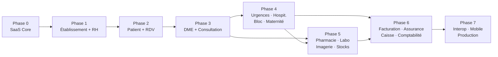

# 02 — Feuille de route de construction

- **Statut** : Proposé pour les phases 1+ · **🔒 Phase 0 GELÉE — GO implémentation depuis le
  2026-08-23** (voir [00-executive-summary.md](00-executive-summary.md) pour la règle de
  gouvernance post-gel)
- **Date** : 2026-08-23

> **Note de cadrage** — le dépôt est **greenfield**. Il n'existe aucun ERP à migrer. Ce
> document décrit des **phases de construction**, pas une migration. Le nom de fichier
> conserve le libellé demandé pour référence.

---

## Principes de séquencement

1. **La sécurité précède la fonctionnalité.** Le SaaS Core — auth, tenant, RBAC, audit — est
   construit et prouvé avant tout module médical. Un module médical greffé sur une isolation
   tenant non prouvée est un incident de confidentialité en attente.
2. **Une phase n'est close que par ses critères de sortie**, tous automatisés. Pas de « on
   testera après ».
3. **Chaque phase produit sa documentation** (ADR, OpenAPI, glossaire, README de module) —
   la doc fait partie du périmètre, pas d'un rattrapage.
4. **Une phase bloquée par une décision métier ne démarre pas.** Les points « À VALIDER » de
   [03-open-decisions.md](03-open-decisions.md) sont des prérequis, pas des détails.

**Aucune estimation en jours n'est donnée** : la charge dépend de l'effectif, inconnu à ce
stade. Les phases sont ordonnées par dépendance.

### Critères de sortie communs (toute phase)

Reprennent le §37 du cahier des charges et s'appliquent **à chaque module livré** :

| Type de test | Exigence |
|---|---|
| Unitaire | ≥ 90 % sur `domain/` + `application/`, sans infrastructure |
| Intégration | Repositories réels, RLS activé |
| API | Contrat OpenAPI vérifié, cas d'erreur inclus |
| Sécurité | Escalade de privilèges, accès non authentifié, manipulation d'identifiants |
| **Isolation tenant** | **Le tenant A ne peut ni lire ni écrire une donnée du tenant B, même avec un identifiant valide de B** |
| RBAC | Chaque rôle non autorisé est refusé sur chaque opération |
| E2E | Parcours critique de la phase |
| Architecture | `domain/` sans framework — build en échec sinon |
| Audit | Chaque accès/modification de donnée médicale produit une entrée d'audit |

---

## Phase 0 — Fondations et SaaS Core

**🔒 GELÉE — implémentation démarrée le 2026-08-23.**

**Objectif** : disposer d'une plateforme où un établissement peut être créé, payé, activé, et
où un utilisateur se connecte dans un tenant strictement isolé, avec tout accès tracé.

**Ordre d'implémentation retenu** : 1. Foundation/monorepo/conventions — 2. Identity + RBAC +
`UserTenantMembership` — 3. Tenant + contexte serveur + RLS — 4. Plan/PlanPrice/Subscription —
5. Payment/PlatformInvoice + `PaymentProvider` — 6. Outbox + événements + idempotence —
7. MFA — 8. Sessions/refresh-token rotation — 9. Notifications Email+SMS — 10. Saga
provisioning + impayé/mode dégradé — 11. Audit plateforme — 12. Tests d'isolation
multi-tenant/sécurité — 13. CI/CD et contrôles de conformité. **Le frontend consomme les
contrats du SaaS Core, il ne les précède pas.**

**Prérequis bloquants** : décisions O-01 (base de données), O-02 (tarification), O-03
(comportement en cas d'impayé), O-04 (périmètre MFA), O-05 (multi-établissement), O-06 (durée
de session), O-07 (canaux de notification), O-25 (prestataire de paiement SaaS) de
[03-open-decisions.md](03-open-decisions.md).
**Statut au 2026-08-23 : les 8 sont clos** (O-03 sous réserve juridique ; O-02, O-04, O-06,
O-07, O-25 avec résidus opérationnels/numériques/fournisseur explicitement tracés — voir
[03-open-decisions.md](03-open-decisions.md) pour le détail). Ces résidus doivent être fermés
avant la fin de la phase, pas avant son démarrage — le résidu fournisseur d'O-25 conditionne
spécifiquement l'implémentation de l'étape `InitiatePayment` de la Saga de provisioning (§6.3
de [01](01-target-architecture.md)), pas le reste du module.

**Livré**
- Shared Kernel : `Entity`, `AggregateRoot`, `ValueObject`, `Result`, `DomainEvent`, `UnitOfWork`
- Bus CQRS (Command, Query, Event) et composition root
- Value Objects régionaux : `Money(XOF)`, `PhoneNumber(+221)`, `TenantId`
- Module **Identity & Access** : compte, mot de passe, session, MFA (activable), **détection du
  contexte de connexion côté serveur** (§4)
- Module **Tenant** : établissement, cycle de vie (actif / suspendu / résilié)
- Module **RBAC** : catalogue de permissions, 18 rôles système, rôles personnalisés par tenant
- Module **Plans & Abonnements** : forfaits pilotés par la donnée, capacités et limites,
  vérification de quota
- Module **Paiement SaaS** derrière ACL, avec états `réussi / échoué / en attente / annulé /
  expiré / renouvelé` (§5)
- **Saga de provisioning d'établissement** avec compensations (§6.3 de [01](01-target-architecture.md))
- Module **Audit** append-only
- Module **Notifications**, canaux email + SMS (O-07 ; fournisseur SMS et calendrier des
  rappels d'impayé restant à fixer avant la fin de la phase)
- Infrastructure Outbox + workers BullMQ
- Console Super Admin (v1) : établissements, abonnements, forfaits, limites, statistiques,
  audit, activation/suspension
- `apps/web` : LoginPage, RegisterPage (flux complet §5), onboarding

**Critères de sortie spécifiques**
- Test de non-fuite inter-tenant au vert sur **tous** les agrégats du SaaS Core
- RLS PostgreSQL actif et vérifié par un test qui contourne délibérément la couche applicative
- E2E : inscription → paiement → provisioning → connexion → onboarding, **et** les chemins
  d'échec de paiement avec compensation effective
- Test prouvant qu'un client transmettant un `tenantId` ou un rôle forgé est ignoré et audité
- Le frontend ne contient **aucun** forfait ni permission codé en dur
- ADR-0001 et ADR-0002 statués « Accepté »

**Aucun module médical n'est ouvert tant que cette phase n'est pas close.**

---

## Phase 1 — Administration d'établissement

**Objectif** : l'admin configure la structure physique et humaine de son établissement.

**Dépend de** : Phase 0.

**Livré**
- `HealthFacility` : 9 types (§7), configuration par type
- Catalogue de **services activables à la carte** (§8), en donnée de référence versionnée
- Structure : bâtiments, unités, salles, **lits avec statuts** (§27)
- Équipements, horaires
- Catalogue d'**actes** et de **tarifs** (structure seulement — *les tarifs sont saisis par
  l'établissement, aucun barème n'est fourni ni présumé*)
- Référentiels assureurs et partenaires (structure)
- **RH de base** (§26) : personnel, contrats, horaires, planning, congés, absences, gardes,
  astreintes. **Paie hors scope.**
- Rattachement `StaffMember` ↔ `UserAccount` (par identifiant)

**Critères de sortie**
- Communs + l'activation d'un service est refusée si le forfait ne la couvre pas
- Transitions de statut de lit conformes aux invariants ; transitions interdites rejetées
- E2E : création d'établissement → activation de services → création de personnel → attribution
  de rôles

---

## Phase 2 — Patient et rendez-vous

**Objectif** : identifier les patients de façon fiable et gérer l'agenda.

**Dépend de** : Phase 1 (services, personnel, salles).

**Livré**
- Agrégat `Patient` (§9) : identité, `PatientNumber` **unique par établissement**, photo,
  contact d'urgence, couverture assurance
- Détection de doublon à la création (règle de rapprochement **À VALIDER MÉTIER**, O-10)
- Module **Rendez-vous** (§11) : prise, calendrier, disponibilités par médecin / service /
  salle, annulation, report, historique
- Rappels de rendez-vous par email via BullMQ
- Squelette du `MedicalRecord` (dossier vide, sans contenu clinique)

**Critères de sortie**
- Communs + test prouvant qu'un `PatientNumber` du tenant A n'est jamais résolvable par B
- Test d'absence de double réservation sur un même créneau/salle (cohérence forte)
- **Chaque ouverture de fiche patient est auditée**
- E2E : création patient → prise de rendez-vous → report → annulation

---

## Phase 3 — DME et consultation

**Objectif** : produire et consulter de la donnée clinique, sous contrôle d'accès strict.
**C'est la phase la plus sensible du projet.**

**Dépend de** : Phase 2. **Prérequis bloquants** : O-08 (contexte clinique), O-11 (rectification
d'une consultation validée), O-16 (référentiels de codification).

**Livré**
- `MedicalRecord` complet (§10) : antécédents, allergies, traitements en cours, documents
- `Encounter` (§12) : motif, histoire, constantes, examen clinique, hypothèses, diagnostic,
  actes, prescriptions, examens demandés, conclusion
- **Immuabilité de la consultation validée**, rectification par version liée et auditée
- `Prescription` (structure ; la dispensation arrive en phase 5)
- `ClinicalAccessPolicy` (Strategy) implémentant la règle validée en O-08
- **Piste d'audit d'accès au dossier** complète : lectures autorisées **et refusées**
- Tableau de bord Médecin (§29)

**Critères de sortie**
- Communs, renforcés :
  - test prouvant qu'un professionnel **sans contexte clinique** se voit refuser l'accès à un
    dossier même avec la permission `patient:read`
  - test prouvant qu'une consultation validée ne peut pas être modifiée
  - test prouvant que **100 %** des accès au dossier produisent une entrée d'audit
  - test prouvant que le journal d'audit n'est modifiable par aucun rôle, `SUPER_ADMIN` inclus
- E2E : consultation complète → prescription → validation → tentative de modification refusée

---

## Phase 4 — Parcours hospitaliers

**Objectif** : couvrir urgences, hospitalisation, bloc opératoire et maternité.

**Dépend de** : Phase 3. **Prérequis** : O-09 (échelle de triage), O-14 (règles de maternité).

**Livré**
- **Urgences** (§13) : triage, niveau de priorité, prise en charge, orientation, UI optimisée
  pour la saisie rapide
- **Hospitalisation** (§14) : admission → unité → chambre → lit → séjour → soins → suivi →
  sortie ; transfert, changement de lit/service, sortie contre avis médical, décès, compte rendu
- **Bloc opératoire** (§15) : programmation, équipe, matériel, implants, consommables,
  anesthésie, compte rendu opératoire, surveillance post-opératoire
- **Maternité** (§16) : suivi de grossesse, CPN, accouchement, nouveau-né, dossier mère-enfant
  relié
- Tableau de bord Infirmier (§29) ; occupation des lits en read model
- Émission des événements `ActeRealise` consommés plus tard par la facturation

**Critères de sortie**
- Communs + **aucune double affectation de lit possible** sous accès concurrent (test de
  concurrence obligatoire)
- Transitions de séjour invalides rejetées par le domaine
- Lien mère ↔ nouveau-né vérifié, avec deux dossiers distincts
- E2E : admission → affectation de lit → soins → transfert → sortie

---

## Phase 5 — Médico-technique

**Objectif** : pharmacie, laboratoire, imagerie, stocks et achats.

**Dépend de** : Phases 3 et 4.

**Livré**
- **Stocks** (§25) : `StockItem` multi-catégories, lots, péremption, emplacements, transferts,
  inventaire, pertes, casse, traçabilité
- **Pharmacie** (§17) : catalogue, dispensation liée à la prescription, retours, alertes de
  péremption et de seuil minimal
- **Laboratoire** (§18) : demande → prélèvement → réception → analyse → **validation
  biologiste** → résultat au dossier ; valeurs de référence, historique
- **Imagerie** (§19) : demande, programmation, compte rendu, validation, archivage des
  métadonnées. **Aucune manipulation de pixels, aucune connexion PACS**
- **Achats** (§24) : fournisseurs, demandes, commandes, réception, factures fournisseurs
- Tableaux de bord Pharmacien et Laboratoire (§29)

**Critères de sortie**
- Communs, renforcés :
  - test prouvant qu'un **résultat non validé n'apparaît jamais** dans le dossier patient
  - test prouvant qu'aucune dispensation depuis un **lot périmé** n'est possible
  - test prouvant qu'aucune dispensation ne dépasse le stock disponible (cohérence forte,
    accès concurrent)
  - traçabilité lot → patient vérifiée de bout en bout
- E2E : prescription → dispensation → décrément de stock ; demande labo → prélèvement →
  validation → résultat au dossier

---

## Phase 6 — Financier

**Objectif** : facturer, encaisser, gérer l'assurance, comptabiliser.

**Dépend de** : Phases 4 et 5 (sources des actes facturables).
**Prérequis bloquants** : O-12 (règles assurance), O-13 (mapping SYSCOHADA), O-18 (moyens de
paiement patient réellement intégrés).

**Livré**
- **Facturation** (§20) : agrégation des `ActeRealise` (consultation, actes, labo, imagerie,
  pharmacie, hospitalisation, bloc) → `PatientInvoice` ; forfaits, reste à payer, reçus,
  annulations, remboursements
- **Assurance** (§21) : assureurs, conventions, `CoveragePolicy` **versionnée et datée**,
  tiers payant, part patient/assureur, rejets, suivi des créances
- **Caisse** (§22) : session, encaissements multi-moyens, reçus, caisse journalière, clôture,
  rapprochement
- **Comptabilité SYSCOHADA** (§23) : plan comptable, journaux, exercices, écritures, comptes
  patients/fournisseurs, caisse, banque, balance, grand livre, états financiers
- Tableaux de bord Caisse et Direction (§29)

**Critères de sortie**
- Communs, renforcés :
  - **invariant de partie double** : aucune écriture déséquilibrée ne peut être persistée
  - une écriture validée n'est jamais modifiée — correction par extourne uniquement
  - une session de caisse clôturée est immuable
  - test prouvant que la facturation **n'accède à aucune donnée clinique** au-delà du code
    d'acte (séparation de confidentialité)
  - montants `XOF` entiers ; aucun flottant en persistance
- E2E : actes → facture → prise en charge assurance → encaissement → écriture comptable →
  balance équilibrée

---

## Phase 7 — Interopérabilité, mobile offline, durcissement production

**Objectif** : ouvrir la plateforme vers l'extérieur et la rendre exploitable en conditions
réelles.

**Dépend de** : Phase 6.

**Livré**
- **Mobile offline-first** (§38) : périmètre hors-ligne restreint par rôle, stockage local
  chiffré, file de synchronisation, retry, anti-doublon par UUID client, **purge vérifiée à la
  déconnexion**, conflits cliniques remontés pour arbitrage humain
- **Application desktop**
- **Couche d'interopérabilité** (§33) derrière ACL : FHIR R4, HL7 v2, DICOM/PACS, API publique.
  *Chaque brique n'est déclarée qu'après test de conformité passé — voir O-19, O-20*
- **Durcissement production** (§39) : sauvegardes chiffrées avec **restauration testée**,
  supervision, alerting, rate limiting, health checks, secrets, CI/CD complet, plan de reprise
  d'activité documenté et **exercé**
- Documentation d'exploitation : runbooks, `docs/disaster-recovery/`

**Critères de sortie**
- Communs, renforcés :
  - test prouvant que le stockage mobile local est **entièrement purgé** à la déconnexion
  - test prouvant qu'une synchronisation rejouée ne crée pas de doublon
  - **exercice de restauration réussi** depuis une sauvegarde, chronométré
  - aucune conformité FHIR/HL7/DICOM annoncée sans preuve de test
- Revue de sécurité complète avant ouverture en production

---

## Vue d'ensemble des dépendances

## Risques de séquencement

| Risque | Impact | Traitement |
|---|---|---|
| Pression pour livrer du médical avant la fin de Phase 0 | Fuite de données inter-tenant | Refus. Le §43 place la sécurité au premier rang |
| Décisions O-08 / O-12 / O-13 non arbitrées à temps | Phases 3 et 6 bloquées | Escalade dès maintenant ; ne pas inventer de règle par défaut |
| Facturation développée avant que les actes soient produits | Modèle de facturation déconnecté du réel | Ordre P4/P5 → P6 maintenu |
| Tentation d'annoncer FHIR/DICOM commercialement | Engagement intenable, risque contractuel | D8 : aucune annonce sans test de conformité |
| Périmètre offline trop large | Données de santé exposées sur terminal perdu | Périmètre restreint et explicite, chiffrement, purge |
